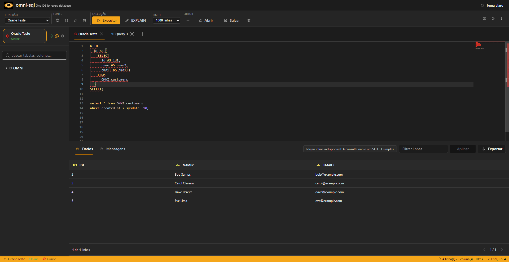
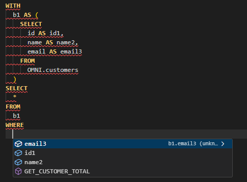
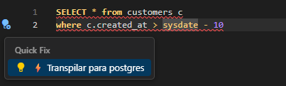
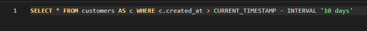

<p align="center">
  
</p>

<h1 align="center">omni-sql</h1>

<p align="center">A fast desktop SQL IDE with CTE-aware autocomplete and dialect intelligence.</p>

<p align="center">
  <a href="https://github.com/cccadet/omni-sql/releases/latest"><strong>Download latest release</strong></a>
</p>

<p align="center"><strong>Early-stage software · Windows x64 and Linux amd64 releases</strong></p>

<p align="center">
  <a href="https://github.com/cccadet/omni-sql/actions/workflows/ci.yml"></a>
  <a href="https://github.com/cccadet/omni-sql/releases/latest"></a>
  <a href="LICENSE"></a>
</p>



## Overview

omni-sql is a local desktop SQL IDE for PostgreSQL, MySQL, MariaDB, SQL Server,
and Oracle. It keeps query writing, database browsing, execution, and results
in one clear workspace.

## Why omni-sql

- Unified local workspace for writing queries, browsing databases, executing SQL, and inspecting results
- Metadata-backed autocomplete for tables, columns, CTE names, and CTE columns
- Dialect-transpilation quick fixes from SQL diagnostics
- Lightweight Tauri desktop app with primary-key-gated inline edits

## Features

### SQL intelligence

- Metadata-backed autocomplete for tables, columns, CTE names, and CTE columns
- SQL diagnostics with dialect-transpilation quick fixes

### Database workflow

- Schema browser with columns, keys, indexes, functions, and object definitions
- Integrated textual `EXPLAIN` for native relational connections
- Inline edits only when primary-key checks establish a safe update path

### Connectivity

- Generic JDBC connections with a user-supplied driver JAR (experimental)

## Database support

| Database | Support |
| --- | --- |
|  PostgreSQL | <span style="color: green;">✅ Supported</span> |
|  MySQL | <span style="color: green;">✅ Supported</span> |
|  MariaDB | <span style="color: green;">✅ Supported</span> |
|  SQL Server | <span style="color: green;">✅ Supported</span> |
|  Oracle | <span style="color: green;">✅ Supported</span> |
|  Generic JDBC | Experimental |

Generic JDBC requires a JDBC URL, driver JAR, and driver class supplied by the
user. It currently provides limited query execution and basic metadata only;
plans, indexes, definitions, and row edits are not available.

## Install

Early-stage project. Download [latest release](https://github.com/cccadet/omni-sql/releases/latest).
End users need no Node.js, Java, Rust, database client, or client SDK.

Available release assets:

- **Windows x64:** installer
- **Linux amd64:** Debian package
- **Checksums:** SHA-256 file for downloaded assets

## Quick start

1. Install the package for your platform.
2. Open omni-sql and create a connection.
3. Select database type, enter connection details, and use **Test connection**.
4. Choose SSL and schema settings where needed.
5. Browse or reload metadata, open a SQL tab, and start writing.
6. Run the selection or current statement. Inspect, filter, sort, page, or export results.

## Roadmap

- ✅ Native PostgreSQL, MySQL, MariaDB, SQL Server, and Oracle adapters
- ✅ CTE-aware autocomplete
- 🧪 Generic JDBC (experimental)
- 📋 ODBC
- 📋 MongoDB (deferred to v2)

## Features in action

### CTE column autocomplete



Complete columns from common table expressions while writing queries.

### PostgreSQL dialect-transpilation quick fix





Turn a dialect diagnostic into PostgreSQL-compatible SQL without leaving editor.

## MCP STDIO / Streamable HTTP (Codex / Claude Desktop / ChatGPT Desktop)

MCP integration is local-only by default: server runs via STDIO and talks to a
running Omni SQL instance over authenticated loopback HTTP. Build server with:

```bash
pnpm --filter @omni-sql/mcp-server build
```

STDIO remains default. Opt into Streamable HTTP with
`--transport streamable-http` or `OMNI_SQL_MCP_TRANSPORT=streamable-http`; listener
defaults to `127.0.0.1:41922/mcp` and rejects non-loopback host values. HTTP mode
requires separate ingress bearer secret in `OMNI_SQL_MCP_HTTP_TOKEN`; descriptor
token remains backend-bridge credential and is never used for HTTP ingress.

For public access, use Secure MCP Tunnel as public HTTPS/auth boundary. Tunnel
must inject `Authorization: Bearer $OMNI_SQL_MCP_HTTP_TOKEN` upstream without
exposing secret, and preserve Streamable HTTP `POST`, `GET`, and `DELETE`, MCP
headers (`Mcp-Session-Id`, `Mcp-Protocol-Version`, `Last-Event-ID`, `Accept`,
`Content-Type`), and streaming SSE responses without buffering or method rewrite.
Tunnel owns public HTTPS/auth; this listener does not add OAuth.

Start Omni SQL first. Open the MCP status menu in the IDE and copy its generated
`command` and `args`; the runtime descriptor exists only while that IDE process
is running. The launcher contract is exactly:

```json
{
  "command": "<copy generated command>",
  "args": ["<copy generated args[0]>", "<copy generated args[1]>"]
}
```

Do not replace generated values with `node`, guessed paths, a working directory,
environment variables, or descriptor contents. For Codex, map those exact fields
to its MCP configuration or CLI, then verify with `codex mcp list`:

```bash
codex mcp add omni-sql -- "<generated command>" \
  "<generated args[0]>" "<generated args[1]>"
```

Six tools are exposed: active SQL, active connection context, active schema
summary, latest SQL execution error, opening a SQL tab, and proposing a SQL edit.
No tool executes SQL or
exposes passwords, tokens, connection strings, arbitrary files, or a shell.
Opening a tab is non-executing; edits require explicit desktop approval and
stale-state checks. Returned SQL and metadata are still visible to the connected
local MCP client.

### Claude Desktop STDIO configuration

Start Omni SQL, then copy generated `command` and `args` fields from Omni SQL
MCP status UI. In Claude Desktop, open **Settings > Developer > Edit Config** and
merge this entry into existing JSON:

```json
{
  "mcpServers": {
    "omni-sql": {
      "command": "<copied command from Omni SQL UI>",
      "args": ["<copied args[0]>", "<copied args[1]>"]
    }
  }
}
```

Preserve existing `mcpServers` entries; add `omni-sql` inside that object, never
create duplicate `mcpServers` keys. In Windows JSON, escape each backslash as
`\\`. Fully quit and reopen Claude Desktop. Under **Connectors**, Omni SQL should
show **Running**. If it does not, inspect **Developer logs** for launcher errors.
Never copy or expose runtime descriptor contents or any descriptor/backend/HTTP
token; copy only generated launcher fields and keep their values private.

ChatGPT Desktop and Codex can use this local STDIO launcher. ChatGPT in a
browser cannot connect to a local STDIO process; it requires a separate remote
HTTPS app integration.

See the [MCP integration and security notes](docs/MCP.md).

## Documentation

- [Database support and connections](docs/DATABASE-SUPPORT.md)
- [MCP STDIO integration plan](docs/MCP.md)
- [Troubleshooting](docs/TROUBLESHOOTING.md)
- **Developer docs:** [Development](docs/DEVELOPMENT.md), [Building](docs/BUILDING.md), [Architecture](docs/ARCHITECTURE.md)
- Português (Brasil) — translation planned; not yet available

## Built with

Built with Tauri, React, Fluent UI, and Monaco Editor.

## Contributing

Read [CONTRIBUTING.md](CONTRIBUTING.md) before opening an issue or pull request.

## License

[MIT](LICENSE)
