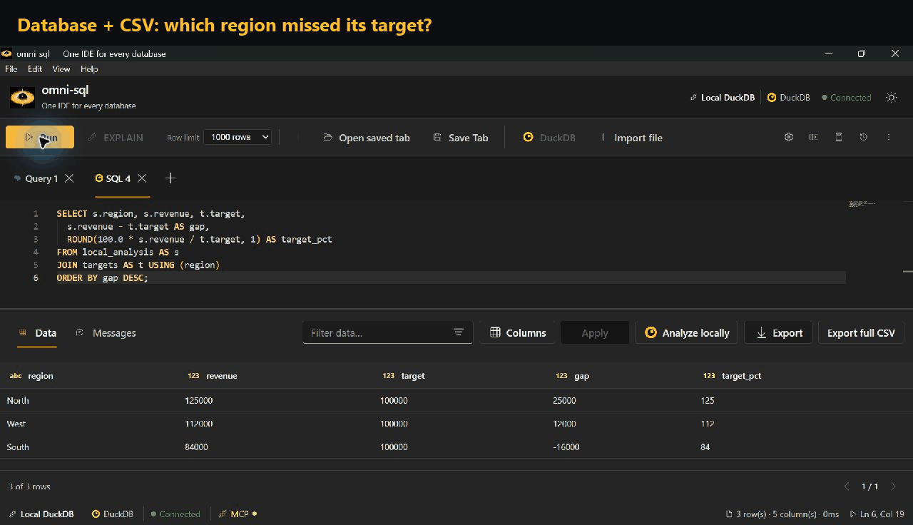
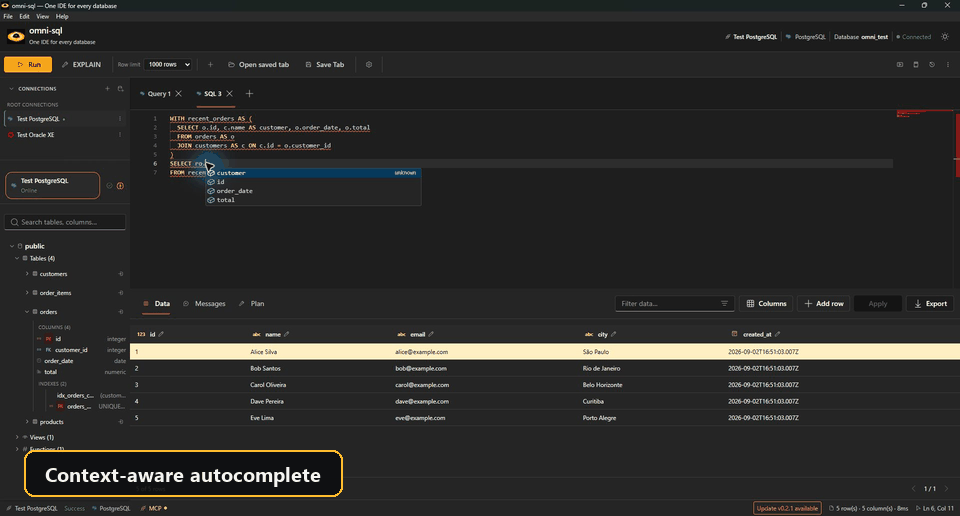
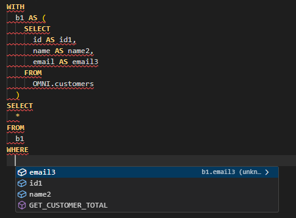
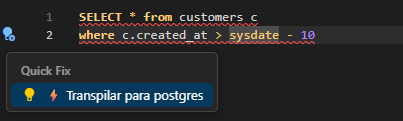
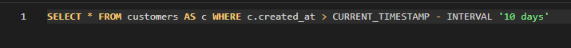
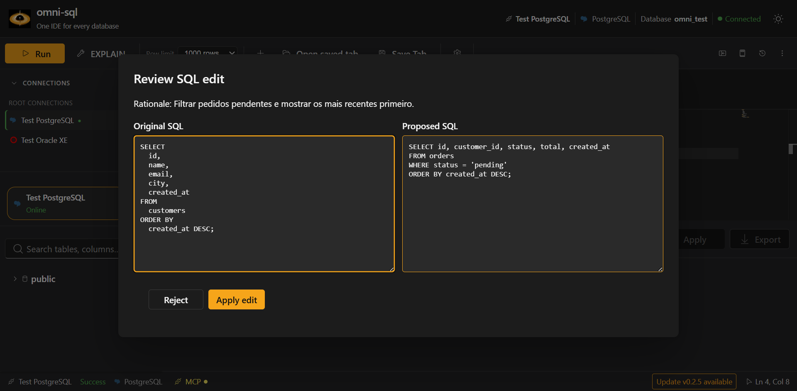

<p align="center"></p>
<h1 align="center">omni-sql</h1>
<p align="center"><strong>Query CSV and Parquet in your SQL IDE, locally.</strong></p>
<p align="center">An open-source SQL workspace with DuckDB analysis and native connections to<br />PostgreSQL, MySQL, MariaDB, SQL Server, and Oracle.</p>
<p align="center"><a href="https://github.com/cccadet/omni-sql/releases/latest"><strong>Download omni-sql</strong></a> · <a href="#analyze-files-and-database-results-locally">Try local analysis</a> · <a href="#quick-start">Quick start</a> · <a href="docs/DATABASE-SUPPORT.md">Database support</a></p>
<p align="center"><strong>Runs locally · No account required · No separate runtime or database client to install</strong></p>
<p align="center">
  <a href="https://github.com/cccadet/omni-sql/actions/workflows/ci.yml"></a>
  <a href="https://sonarcloud.io/summary/new_code?id=cccadet_omni-sql"></a>
  <a href="https://github.com/cccadet/omni-sql/releases/latest"></a>
  <a href="LICENSE"></a>
</p>

<p align="center"><sub>Early-stage software · Windows x64, Linux amd64 and macOS Apple Silicon / Intel installers</sub></p>

## Analyze files and database results locally

Received a CSV or Parquet export to investigate? Import it and query it with SQL
in the same desktop IDE, using embedded DuckDB. A spreadsheet fits this workflow
when exported as CSV. You do not need to load the file into your source database
or write a separate script.

You can also import a database query result and join it with the file locally,
including results from another supported connection.

**Example:** sales are in PostgreSQL, targets are in a CSV. Import both and use
a local SQL join to find the region that missed its target without uploading
the file to PostgreSQL. [Try the demo with fictional data](docs/demo/README.md).



1. Run a source query and open **Analyze locally**.
2. Choose **Full query result** to load the full source query, or choose a sample.
3. Add a CSV or Parquet dataset and join it with the imported result using SQL.
4. Inspect the result and export the full local query output.

A full export contains the rows available in your imported datasets. If you
imported a sample, the export still represents that sample.
[Read about import coverage and provenance](docs/ANALYTICAL-PROVENANCE.md).

## SQL editing and database exploration

The editor has metadata and CTE-aware completion, dialect quick fixes, and
supported execution plans. Browse schemas and definitions, inspect results,
and edit rows when primary-key checks establish a safe update path.
Compatible AI clients can propose SQL changes through the
[local MCP integration](#mcp-integration), with an approval dialog before applying them.



Use `/catalog` in the editor to find SQL templates for the active dialect, including
`/catalog insert` for an **Insert row** example. Oracle Explain displays available
row, byte, cost, and time estimates alongside plan predicates.

## Database support

| Database | Connection | Metadata autocomplete | Query execution |
| --- | :---: | :---: | :---: |
|  PostgreSQL | ✅ | ✅ | ✅ |
|  MySQL | ✅ | ✅ | ✅ |
|  MariaDB | ✅ | ✅ | ✅ |
|  SQL Server | ✅ | ✅ | ✅ |
|  Oracle | ✅ | ✅ | ✅ |
|  Generic JDBC | 🧪 Experimental | Basic | Limited |

Generic JDBC uses a driver JAR, JDBC URL, and driver class supplied by the user.
Plans, indexes, definitions, and row edits are not currently available for generic JDBC.
See the [database support guide](docs/DATABASE-SUPPORT.md) for connection details and limitations.

## Install

Download the package for your platform from the **[latest GitHub release](https://github.com/cccadet/omni-sql/releases/latest)**.

| Platform | Package | Status |
| --- | --- | --- |
| Windows 10/11 x64 | `.exe` installer | Available |
| Debian/Ubuntu amd64 | `.deb` package | Available |
| macOS 15+ Apple Silicon / Intel | `.dmg` installer | Included starting with v0.7.1 |
| Linux ARM, AppImage, RPM | — | Not packaged yet |

Release assets include a `SHA256SUMS` file so downloads can be verified. End users
do not need to install Node.js, Java, Rust, a database client, or a vendor client SDK.

### macOS first launch

Choose the `aarch64.dmg` download for Apple Silicon (M1 or newer), or `x64.dmg`
for an Intel Mac. Open the disk image, drag **omni-sql** to **Applications**,
and launch it from there.

Initial macOS packages use a free ad-hoc signature and are not notarized by Apple.
If macOS blocks the first launch because the developer cannot be verified, open
**System Settings → Privacy & Security → Open Anyway**, then confirm opening
omni-sql. Follow [Apple's instructions](https://support.apple.com/102445) for an
app downloaded from a source you trust. No paid Apple account is needed to install.

Node.js, Java and the ODBC driver manager are bundled. ODBC connections still
require a separately installed driver for the database, as on other platforms.

> omni-sql is early-stage software. Test it with development data before using it
> against important environments, and please report unexpected behavior.

## Quick start

For files only, install the app, choose **Import file**, and select a CSV or
Parquet file. Query the imported table in the **Local DuckDB** SQL tab.

To work with a database:

1. Install the package for your platform.
2. Open omni-sql and create a connection.
3. Select a database type, enter the connection details, and choose **Test connection**.
4. Configure SSL and schema settings when needed, then connect.
5. Browse metadata or open a SQL tab and start writing.
6. Run the selection or current statement, then inspect, filter, sort, page, or export the results.
7. Open **Analyze locally** to import a displayed result, stream a full query or sample, or add CSV/Parquet datasets for local joins.

For full imports, sampling, S3, driver precision, and export behavior, read the
[local analysis guide](docs/LOCAL-ANALYSIS.md) and [data provenance guide](docs/ANALYTICAL-PROVENANCE.md).

Need help connecting? Read [Database support](docs/DATABASE-SUPPORT.md) or [Troubleshooting](docs/TROUBLESHOOTING.md).

## Features in action

### Complete columns projected by a CTE



omni-sql combines database metadata with the SQL in the editor to suggest columns
projected by common table expressions.

### Adapt SQL through a dialect quick fix

<p> </p>

Supported diagnostics can offer a quick fix that rewrites the statement for the
active database dialect without leaving the editor.

## Positioning

omni-sql combines SQL editing with local analysis of imported database results
and files. Mature tools such as DBeaver and DataGrip cover broader administration
and ecosystem needs. You can use omni-sql alongside them for local DuckDB analysis.

| Choose omni-sql when you want… | Consider a broader tool when you need… |
| --- | --- |
| Local DuckDB joins across imported database results and files | Deep vendor-specific administration |
| One editor across five major relational databases | Built-in data modeling and migration tools |
| CTE and metadata-aware SQL completion | A large plugin ecosystem or enterprise support |
| A local desktop app with no account | Built-in data modeling, migration, or team features |
| An MIT-licensed project you can inspect and contribute to | An established, long-supported product |

## MCP integration

omni-sql includes a local MCP server that lets compatible AI clients work with the
SQL tab you already have open. An assistant can read the active statement and its
database context, inspect schema metadata and indexes, explain a query without
executing it, prepare an edit for review, or execute SQL after explicit approval in the desktop.



```text
AI client  ──MCP/STDIO or HTTP──▶  local omni-sql bridge  ──▶  active desktop tab
                                                        │
                                                        └─ edits and SQL execution require approval
```

| Tool | What it does |
| --- | --- |
| `getActiveSql` | Reads the SQL and dialect from the active tab. |
| `getActiveConnectionContext` | Reads safe connection context without credentials. |
| `getSchemaSummary` | Lists schemas, relations, and columns available to the active connection. |
| `getTableIndexes` | Inspects indexes for one table. |
| `explainSql` | Produces a non-executing query plan. |
| `getLatestSqlExecutionError` | Reads the latest execution error from the active tab. |
| `proposeSqlEdit` | Opens a before/after proposal that you can apply or reject in omni-sql. |
| `executeSql` | Runs SQL on the active connection after explicit desktop approval, returning bounded results. |

The default transport is local STDIO. The generated launcher configuration is
available from the **MCP** item in the status bar after the backend is ready. Copy
its `command` and `args` exactly into your MCP client; runtime paths are temporary
and are regenerated whenever omni-sql starts.

Optional Streamable HTTP can be started from **MCP > Configuration > HTTP** with
a separate token and a loopback endpoint (default `http://127.0.0.1:41922/mcp`).
SQL execution can modify data or structure and always requires desktop approval.
The integration cannot read stored passwords or connection strings, access files
through dedicated tools, or bypass the approval dialog. See the [MCP guide](docs/MCP.md) for Codex,
Claude Desktop, and ChatGPT Desktop setup, optional Streamable HTTP transport,
verification steps, limits, and the complete security model.

## Roadmap

- ✅ Native PostgreSQL, MySQL, MariaDB, SQL Server, and Oracle adapters
- ✅ CTE-aware autocomplete
- 🧪 Generic JDBC (experimental)
- 🧪 ODBC (experimental; requires a separately installed 64-bit driver)
- ✅ MongoDB: native Extended JSON, autocomplete, SQL-to-native conversion with `/mongo`, and read-only SQL via DuckDB. See [MongoDB usage](docs/MONGODB.md).
- 📋 More installer formats and platforms

## Documentation

- [Local analysis with DuckDB](docs/LOCAL-ANALYSIS.md)
- [Database support and connections](docs/DATABASE-SUPPORT.md)
- [Troubleshooting](docs/TROUBLESHOOTING.md)
- [MCP integration](docs/MCP.md)
- [Development](docs/DEVELOPMENT.md)
- [Building](docs/BUILDING.md)
- [Architecture](docs/ARCHITECTURE.md)
- [Local analysis implementation and remaining work](docs/RUST_DATA_ENGINE_TODO.md)

Built with Tauri, React, Fluent UI, Monaco Editor, TypeScript, Rust, and Kotlin.

## Help the project grow

If omni-sql is useful to you, **[star the repository](https://github.com/cccadet/omni-sql)**
to help other developers discover it. You can [report a bug](https://github.com/cccadet/omni-sql/issues/new/choose),
share a database compatibility result, or suggest a focused improvement. Pull requests
are welcome—please read [CONTRIBUTING.md](CONTRIBUTING.md) first.

Tried installing or running your first database + file join?
[Share your first-run experience](https://github.com/cccadet/omni-sql/issues/new?template=first_run.yml),
including successful attempts. Tell us your platform, database, and where you
got stuck.

## License

[MIT](LICENSE)
