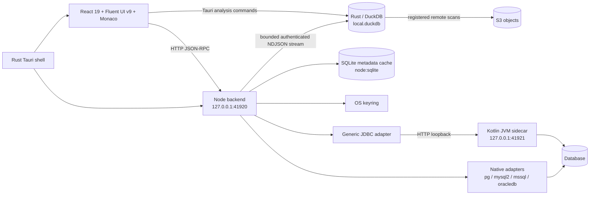
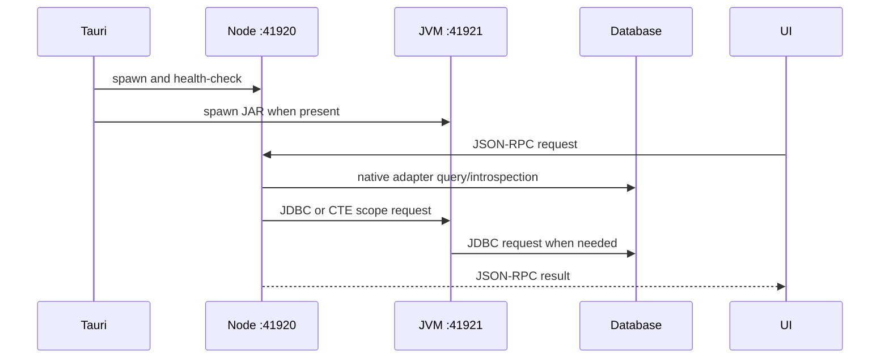

# Architecture

omni-sql is a local desktop application. The browser Vite mode exists only for
frontend development.

## Components

- **Tauri shell:** Rust starts and stops the Node backend and optional JVM
  sidecar, owns the native window, and exposes restricted file-picker commands.
- **Frontend:** React 19, Fluent UI React v9, and Monaco Editor. It calls the
  backend through the desktop HTTP JSON-RPC contract.
- **Node backend:** TypeScript HTTP JSON-RPC service on loopback port `41920`.
  It owns connection state, handlers, adapters, metadata synchronization, and
  autocomplete orchestration.
- **Metadata cache:** SQLite through Node's built-in `node:sqlite`, including
  metadata timestamps. Passwords use the OS keyring; development fallback is
  explicitly opt-in.
- **Native adapters:** PostgreSQL (`pg`), MySQL/MariaDB (`mysql2/promise`),
  SQL Server (`mssql`/Tedious), and Oracle (`oracledb` thin mode).
- **JVM sidecar:** Kotlin/JDK HTTP service on `127.0.0.1:41921`. Apache
  Calcite resolves CTE output column names for tier-2 autocomplete. It also
  loads user-supplied JDBC drivers.
- **Rust analytical engine:** DuckDB owns local datasets, analytical queries,
  file imports/exports, and S3 readers. Durable dataset metadata is stored in
  `local.duckdb`; federated datasets and result handles are temporary. The Node
  backend streams relational source rows to Rust as bounded NDJSON batches.
  S3 readers use separate connections, install required DuckDB extensions, and
  restrict editor execution after registered sources are created.

## Runtime flows

The JVM sidecar is optional and used on a best-effort basis. If absent,
unavailable, or slow, completion falls back to tier 1; the request does not
fail.

Local analysis uses Tauri commands in the main IDE. A grid preview and a full
analytical import have separate limits: sampling during import changes the data
available to subsequent joins and aggregates. S3 CSV, Parquet, Delta, and Iceberg
scans require their DuckDB extensions; first use may need network access for
installation. See the [current engine plan](RUST_DATA_ENGINE_PLAN.md) for the
resource and security model and the [acceptance checklist](RUST_DATA_ENGINE_TODO.md)
for remaining validation.
